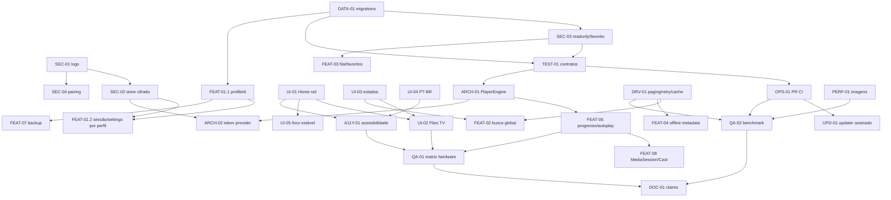

# Auditoria técnica do Makimono

**Escopo auditado:** `takaokensei/makimono`, branch `main`, commit `8f4ce266b98587eb4afe1c8de207e8cc72ff2034`.
**Data do checkout:** `2026-09-18T19:44:58Z`. **Commits:** 45. **Nota geral:** **5,1/10, confiança média**.

## 1. Resumo executivo

- O código tem uma base funcional ampla: Hilt, ViewModels/StateFlow, dois engines, Drive, MAL, AniSkip, legendas e updater.
- A paginação de `DriveRepository.getAllFiles` existe, mas outras listagens ainda são de uma página.
- A UI tem layouts dedicados para Home, detalhes e Settings em landscape, com foco manual em várias superfícies.
- O escopo OAuth efetivo continua `drive`, apesar de `strings.xml` declarar `drive.readonly`.
- O rail de TV não é realmente persistente: o `sidebarDimOverlay` presente na variante land ativa o modo recolhível.
- Há risco P0 de logging de credencial/token em debug: logging BODY e `saveClient: $client`.
- Tokens do Drive são gravados sem criptografia em DataStore; o Room usa migração destrutiva.
- Não foi possível executar Gradle: o checkout não tem bit executável em `gradlew` e o ambiente não tem Java/SDK Android.
- Não houve emulador ou hardware TV; cold start, primeiro frame e tamanho do APK ficaram não medidos.
- O relatório do autor atribui 9,5/10; a evidência disponível sustenta 5,1/10 e não valida a alegação comercial.
- Veredito: **produto promissor e relativamente completo como protótipo avançado, ainda não pronto para declarar robustez de produção**.

## 2. Escopo e limitações

### O que foi executado

- Clone oficial bem-sucedido em `/tmp/makimono`. A pasta `makimono/` existente no workspace não era um repositório Git, portanto não foi sobrescrita.
- Registro de `HEAD`, branch, data, contagem de commits, tags e remote.
- Leitura do código Kotlin/Java, XML, Gradle, manifesto, workflow e documentação declarada.
- Busca de claims no código e nos documentos, incluindo paginação, media keys, foco, OAuth, Firebase, AdMob, imagens, strings e testes.
- Varredura de histórico com fallback `git log -p --all` e padrões seguros; `gitleaks` e `trufflehog` não estão instalados.
- Tentativa dos cinco comandos de build pedidos, exatamente como escritos.
- Tentativa equivalente via `bash ./gradlew` para confirmar a causa raiz do bloqueio.

### O que foi apenas lido

- Arquitetura, ciclo de vida, rede, Room, players, estados e UI foram auditados por fonte.
- As telas foram avaliadas por XML/Kotlin, sem renderização real.
- Dependências foram avaliadas por versão declarada e sinais de obsolescência; não foi executado scanner OSV/Dependabot.

### O que não foi possível verificar

- Nenhum build, lint ou teste executou: `./gradlew` retornou `Permission denied`; `bash ./gradlew` retornou ausência de `JAVA_HOME` e de `java`.
- Não houve emulador Android, Android TV 1080p/4K, celular, screenshot, GIF, teste D-pad, TalkBack, PiP, rede real ou episódio de 1,5 GB.
- Não foi possível medir cold start, tempo até o primeiro frame, consumo de memória, jank, throughput, tamanho do APK ou cobertura JaCoCo.
- Não foi possível afirmar ausência absoluta de segredo histórico: os scanners dedicados não existem. A varredura de padrões comuns não encontrou `AIza`, `ghp_` ou `github_pat` no histórico auditado.
- O bloco `<modelo_jurix>` veio apenas como placeholder, sem plano de referência. A estrutura abaixo replica a granularidade explicitamente exigida no pedido, não um conteúdo que não foi fornecido.

### Regra de evidência

`Fato` é algo visto no arquivo ou na saída de comando. `Inferência` é uma consequência técnica provável. `Não verificado` não foi tratado como confirmado.

## 3. Inventário

### 3.1 Árvore de 2 a 3 níveis

`tree` não está instalado; a árvore equivalente foi obtida com `git ls-files`, limitada a três componentes:

```text
.
├── app/
│   ├── build.gradle
│   ├── libs/extension-ffmpeg-release.aar
│   └── src/{main,test,androidTest}
├── mpv/
│   ├── build.gradle
│   └── src/main/{java,assets,res}
├── gradle/wrapper/
├── docs/
│   └── kodi_reference/
├── .github/workflows/release.yml
├── AUDIT_REPORT.md
├── README.md
├── README_MUDANCAS.md
├── makimono-final.diff
├── build.gradle
├── gradle.properties
├── gradlew
└── settings.gradle
```

### 3.2 Linguagens e linhas

| Área | Arquivos observados | LOC | Evidência |
|---|---:|---:|---|
| `app/src/main` Kotlin/Java | 108 Kotlin + código Java compartilhado | 20.196 | `wc -l` por `app/src/main/.*\.(kt\|java)` |
| `app/src/test` | 8 classes de teste | 667 | `wc -l` por `app/src/test/.*\.(kt\|java)` |
| `mpv/src/main` | Kotlin/Java do módulo player | 522 | `wc -l` por `mpv/src/main/.*\.(kt\|java)` |
| XML de recursos do app | layouts, drawables, values e manifest | 11.448 | `wc -l` por `app/src/main/res/.*\.xml` |
| XML repo-wide | 178 arquivos XML | não separado por módulo | `git ls-files '*.xml' | wc -l` |
| Gradle/properties | 6 arquivos | 327 | `git ls-files '*.gradle' '*.properties'` |

### 3.3 Dependências e maturidade

As versões abaixo são fatos do `app/build.gradle:144-221` e `build.gradle:9-18`. Os anos são referência aproximada de lançamento upstream; CVEs específicos não foram declarados sem uma consulta OSV/NVD executada.

| Dependência | Versão | Estado técnico em 2026 | Risco/ação |
|---|---|---|---|
| Android Gradle Plugin | 8.2.2 | antigo para compile SDK moderno | atualizar em janela controlada |
| Kotlin | 1.9.22 | antigo | planejar atualização com AGP |
| Gradle wrapper | 8.7 | funcional, não atual | atualizar após AGP |
| ExoPlayer legado | 2.18.7 | linha legada; Media3 é sucessora | migrar para `androidx.media3` |
| Room | 2.6.1 | funcional, não atual | atualizar e criar migrações |
| DataStore | 1.0.0 | antigo | atualizar |
| `security-crypto` | 1.1.0-alpha06 | alpha e API em transição | substituir por solução suportada/Keystore |
| Glide | 4.13.2 | antigo | atualizar com teste de memória |
| Lifecycle | 2.6.1 | antigo | atualizar |
| Coroutines | 1.8.1 | relativamente atual no snapshot | acompanhar |
| Hilt | 2.51.1 | funcional | acompanhar |
| Navigation | 2.8.7 | recente no snapshot | acompanhar |
| Core KTX | 1.10.1 | antigo | atualizar |
| AppCompat | 1.6.1 | antigo | atualizar |
| Material | 1.9.0 | antigo | atualizar |
| ConstraintLayout | 2.1.4 | antigo | atualizar |
| Retrofit | 2.9.0 | antigo | avaliar upgrade |
| OkHttp | 4.12.0 | razoável | acompanhar e auditar logging |
| Moshi | 1.15.0 | razoável | acompanhar |
| Gson | 2.10.1 | legado mantido | remover se não necessário |
| ZXing | 3.5.3 | recente no snapshot | acompanhar |
| FFmpeg AAR local | `extension-ffmpeg-release.aar` | versão/proveniência não declaradas | registrar checksum e origem |

Não há, neste checkout, relatório de vulnerabilidades de dependências. A ausência de um CVE listado neste documento **não** significa ausência de CVE.

### 3.4 Manifesto

Fatos em `app/src/main/AndroidManifest.xml:5-71`:

- Permissões: `INTERNET`, `POST_NOTIFICATIONS`, `REQUEST_INSTALL_PACKAGES`.
- `android.software.leanback` e touchscreen são `required=false`.
- `MainActivity` é `exported=true` e possui `MAIN`, `LAUNCHER` e `LEANBACK_LAUNCHER`.
- `PlayerActivity`, `MPVActivity` e `FileProvider` são `exported=false`.
- `allowBackup=false`.
- PiP é declarado nos dois players.
- Não há `usesCleartextTraffic`, `networkSecurityConfig` ou deep link declarado.
- O redirect OAuth usa loopback HTTP em `strings.xml:65` e `Constants.kt:26`; isso é diferente de uma conexão de API HTTP aberta.

### 3.5 Build

Fatos em `app/build.gradle:68-137`:

- `compileSdk 34`, `minSdk 21`, `targetSdk 33`.
- Release usa R8/minificação e `shrinkResources true`.
- Não há flavors.
- ABIs: `x86`, `x86_64`, `armeabi-v7a`, `arm64-v8a`, além de universal APK.
- Se não há keystore local, release usa a chave debug; em CI isso deveria falhar por `app/build.gradle:41-49`.
- O workflow chama o keystore de opcional em `.github/workflows/release.yml:43-48`, mas `assembleRelease` em CI sem ele é bloqueado pelo próprio Gradle.

### 3.6 CI

Existe apenas `.github/workflows/release.yml`:

- Dispara em tags `v*` ou manualmente.
- Usa JDK 17, lint, unit tests, assemble release, verificação `jarsigner`, checksums e GitHub Release.
- Não roda em pull request.
- Não executa instrumentação, emulador, screenshot, cobertura, análise de dependências, secret scanning ou benchmark.
- `lintDebug` tem `abortOnError false` e `checkReleaseBuilds false` em `app/build.gradle:134-137`.
- O workflow não injeta credenciais MAL/GitHub listadas em `local.properties.example:5-9`; a release pode compilar sem funcionar como updater/MAL.

## 4. Tabela de notas

O teto de 6 foi aplicado quando não há teste automático executado e verde. Para UI TV, também existe teto de 7 por ausência de hardware; o teto efetivo continua 6 quando ambos se aplicam.

| Dimensão | Nota | Teto aplicado | Confiança | Evidências rastreáveis |
|---|---:|---:|---|---|
| Arquitetura | 5,3 | 6 | Alta | Hilt/ViewModels em `app/build.gradle:1-7`, `SeriesDetailViewModel.kt:58-72`; Activities gigantes em `PlayerActivity.kt` (2.687 linhas) e `MPVActivity.kt` (2.132 linhas) |
| Features | 5,7 | 6 | Média | autoplay/playlist em `PlayerActivity.kt:1430-1557`; MAL scrobble em `MalRepository.kt:176-203`; ausência de sincronização entre perfis em `WatchList.kt:9-16` |
| UI TV | 5,8 | 6 | Média | layout dedicado em `layout-land/fragment_home.xml:10-28`; bug do rail em `HomeFragment.kt:395-407` + `fragment_home.xml:893-898`; sem emulador/hardware |
| UI Mobile | 5,4 | 6 | Baixa | variante portrait em `layout-port/fragment_home.xml`; seleção de layout por orientação em `ProfileSelectionFragment.kt:67-75`; sem teste em celular/tablet |
| Player | 5,8 | 6 | Média | media keys em `PlayerActivity.kt:946-953` e `MPVActivity.kt:513-519`; release em `PlayerActivity.kt:2681-2684` e `MPVActivity.kt:2119-2129`; nenhum teste real |
| Drive/Dados | 5,0 | 6 | Alta | paginação em `DriveRepository.kt:64-85`; chamadas sem paginação em `DriveRepository.kt:244-287`; escopo efetivo full em `Constants.kt:27-34` |
| Segurança | 4,2 | 6 | Alta | logging BODY em `ApiModule.kt:42-47`; credencial no log em `SessionManager.kt:26-32`; Drive token sem criptografia em `SessionManager.kt:50-90` |
| Testes | 2,8 | 6 | Alta | 33 métodos `@Test` encontrados, mas todos os Gradle tasks falharam por ambiente; cobertura crítica ausente para Drive/player/UI |
| Performance | 4,8 | 6 | Média | política Glide em `MediaImageLoader.kt:8-49`; caches apenas em memória em `AnimePosterResolver.kt:90-95`; sem benchmark ou APK medido |
| Acessibilidade | 3,8 | 6 | Média | alvos de 32/38dp em `fragment_home.xml:386-448`; vários textos 9-13sp em `layout-land/fragment_home.xml:66-90`; sem TalkBack/Accessibility Scanner |
| Documentação | 4,5 | 6 | Alta | claims de 9,5 em `AUDIT_REPORT.md:13-22`; resultados não reproduzidos em `AUDIT_REPORT.md:113-129`; caminho stale `README_MUDANCAS.md:43` |
| Manutenção/CI | 3,8 | 6 | Alta | apenas release workflow em `.github/workflows/release.yml:3-7`; build falha sem keystore em `app/build.gradle:41-49`; sem PR CI |

**Cálculo geral ponderado:** 5,1/10, com pesos maiores para Features, UI TV, Player e Segurança. A nota do autor, 9,5/10, não foi usada no cálculo.

### Por que diverge de 9,5/10

- O autor conta alterações documentadas como validação; aqui uma correção só recebe crédito pleno após teste reproduzível.
- O relatório afirma `drive.readonly`, mas a tela usa `Constants.DEFAULT_DRIVE_SCOPE = drive`.
- O relatório afirma rail persistente, mas o helper detecta `sidebarDimOverlay` presente na variante land e trata a tela como recolhível.
- O relatório afirma tradução integral, mas não existe `values-pt/` e 57 de 94 strings translatáveis continuam em inglês por classificação manual.
- O relatório afirma build/testes, mas os comandos pedidos não executaram neste checkout/ambiente; portanto a regra de teto impede nota superior a 6 nas dimensões afetadas.
- O relatório chama a segurança de 9,8 embora existam logging BODY, logging de `DriveClient` e DataStore sem criptografia para tokens do Drive.

## 5. Verificação de claims

| Claim | Onde é feita | Verificado no código? | Veredito |
|---|---|---|---|
| Média geral 9,5/10 | `AUDIT_REPORT.md:13-22` | Não há teste/hardware que sustente; há achados P0/P1 abaixo | Falso como conclusão |
| `getAllFiles` pagina com `pageToken` | `AUDIT_REPORT.md:32-33` | `DriveRepository.kt:64-85` itera token até fim, com limite de 25 páginas | Confirmado, com ressalva |
| Toda listagem Drive é paginada | inferência do claim anterior | `DriveRepository.kt:244-287` usa `driveApi.getFiles` uma vez para irmãos/legendas | Falso |
| Media keys em ExoPlayer | `AUDIT_REPORT.md:34` | `PlayerActivity.kt:946-953` | Confirmado |
| Media keys em MPV | `AUDIT_REPORT.md:34` | `MPVActivity.kt:513-519` | Confirmado |
| Paridade total entre players | `AUDIT_REPORT.md:17,34` | Há implementação duplicada e ciclos diferentes em `PlayerActivity.kt:2681-2684` e `MPVActivity.kt:2068-2129` | Parcial |
| Foco automático no item ativo do menu | `AUDIT_REPORT.md:35` | `PlayerGlassMenuDialog.kt:131-150` | Confirmado por leitura; não testado em TV |
| Foco automático do episódio atual | `AUDIT_REPORT.md:35` | `PlayerEpisodeDrawerDialog.kt:218-227` | Confirmado por leitura; não testado em TV |
| Home TV com rail persistente | `AUDIT_REPORT.md:36` | `fragment_home.xml:893-898` define overlay; `HomeFragment.kt:395-407` usa mera presença para recolher rail | Falso |
| Layout land da Home existe | `AUDIT_REPORT.md:36,80` | `app/src/main/res/layout-land/fragment_home.xml` existe, 900 linhas | Confirmado |
| Layout land de detalhes existe | `AUDIT_REPORT.md:37,81` | `app/src/main/res/layout-land/fragment_series_detail.xml` existe, 604 linhas | Confirmado |
| Layout land de Settings existe | `AUDIT_REPORT.md:18,82` | `app/src/main/res/layout-land/fragment_settings.xml` existe, 553 linhas | Confirmado |
| Detalhes renderiza shell antes de metadata | `AUDIT_REPORT.md:37,51-52` | `SeriesDetailViewModel.kt:120-153` publica shell antes de `await` em `156-180` | Confirmado |
| `MediaImageLoader` centraliza imagens | `AUDIT_REPORT.md:19,54-55` | Loader existe em `MediaImageLoader.kt:8-49`, mas next episode usa Glide direto em `PlayerActivity.kt:1481-1489` e `MPVActivity.kt:1717-1725` | Parcial |
| `ThumbnailUrl` sanitiza `=s220` | `AUDIT_REPORT.md:38,77` | `ThumbnailUrl.kt:15-21` e testes em `ThumbnailUrlTest.kt:9-22` | Confirmado por leitura; teste não executado |
| Escopo efetivo é `drive.readonly` | `README_MUDANCAS.md:21-30`, `strings.xml:67` | `SignInFragment.kt:108-110,178-197` preenche `Constants.DEFAULT_DRIVE_SCOPE`; `Constants.kt:27` é `drive` | Falso |
| Firebase Crashlytics/Analytics continua | `README_MUDANCAS.md:66-70` | Não há plugin/dependência/código Firebase e `google-services.json` não está no tree | Falso |
| AdMob foi removido | `README_MUDANCAS.md:32-41` | Não há `play-services-ads`, `MobileAds`, meta-data ou chamada no código atual | Confirmado |
| Segredos foram desacoplados do código atual | `AUDIT_REPORT.md:21`, `README_MUDANCAS.md:45-55` | `app/build.gradle:9-21` lê `local.properties`; `Constants.kt:20-28` usa BuildConfig vazio/configurável | Confirmado no tree atual |
| Histórico foi purgado de qualquer credencial | `AUDIT_REPORT.md:21,32` | `gitleaks`/`trufflehog` ausentes; fallback encontrou 0 padrões `AIza/ghp/github_pat`, mas não prova ausência total | Não verificável |
| Tokens do MAL são criptografados | `AUDIT_REPORT.md:21` | `MalSessionManager.kt:21-39` usa EncryptedSharedPreferences, mas faz fallback para plain prefs | Parcial |
| Legenda é 95% padronizada em ambos os players | `AUDIT_REPORT.md:40` | Exo usa padding 0,035 em `PlayerActivity.kt:825-839`; MPV usa `sub-pos=96` em `MPVActivity.kt:249-258` | Parcial |
| Tradução integral para PT-BR | `AUDIT_REPORT.md:41` | 97 entradas base, 3 não translatáveis, aproximadamente 57/94 ainda inglês; nenhum `values-pt/` | Falso |
| Updater verifica checksum | `AUDIT_REPORT.md:108,117-119` | Verifica quando asset e download existem, mas instala sem verificação em `MainViewModel.kt:174-187` | Parcial |
| `testDebugUnitTest` só falhou por Windows do autor | `AUDIT_REPORT.md:127-129` | Neste ambiente os cinco comandos falham antes do Gradle por `Permission denied`/Java ausente | Não verificável |
| Diff final tem 229 KB | `AUDIT_REPORT.md:64-68` | `wc -c -l makimono-final.diff` = 229314 bytes, 4836 linhas | Confirmado |
| `README_MUDANCAS` aponta diff correto | `README_MUDANCAS.md:43` | O tree contém `makimono-final.diff`, não `mudancas.diff` | Falso |

## 6. Achados priorizados

| ID | Sev | arquivo:linha | Problema | Impacto | Correção recomendada | Teste de aceitação |
|---|---|---|---|---|---|---|
| SEC-01 | P0 | `ApiModule.kt:42-47`; `SessionManager.kt:26-32` | Logging BODY e `saveClient: $client` podem registrar Authorization, client secret e payload OAuth em debug. | Exposição de credenciais via logcat, CI ou suporte remoto. | Redaction interceptor; remover log do objeto; proibir BODY em builds distribuídos. | `./gradlew testDebugUnitTest`; teste de interceptor garante que `Authorization`, `clientSecret` e tokens não aparecem no log capturado. |
| SEC-02 | P1 | `SessionManager.kt:50-90` | Access/refresh tokens do Drive são armazenados em DataStore sem criptografia. | Leitura por backup, root, diagnóstico ou comprometimento do dispositivo. | Keystore-backed encrypted store, migração atômica e limpeza do store legado. | Teste instrumentado grava/lê token e verifica que o arquivo bruto não contém o valor; logout remove ambos. |
| SEC-03 | P1 | `Constants.kt:27-34`; `SignInFragment.kt:108-110,178-197` | UI mostra `drive.readonly`, mas o OAuth efetivo usa `drive`; `updateFile` ainda tenta PATCH. | Violação de least privilege e consentimento incoerente; favoritos podem falhar ou pedir escopo excessivo. | Escolher readonly + favoritos locais, ou declarar explicitamente full scope. Recomendação: readonly. | Roteiro: limpar sessão, abrir auth URL, decodificar `scope`; esperado apenas `drive.readonly`; favoritar local não chama PATCH. |
| SEC-04 | P1 | `TvLoginServer.kt:19-27,39-67,179-194` | ServerSocket wildcard em HTTP aceita refresh token no endpoint `/api/session` sem nonce, expiração ou autenticação. | Qualquer dispositivo na LAN pode tentar injetar/roubar uma sessão. | Pairing nonce de uso único, expiração, origem limitada, payload sem exposição do refresh token e encerramento imediato. | Teste local: POST sem nonce retorna 401; nonce usado duas vezes retorna 409; token nunca aparece em resposta/log. |
| UI-01 | P1 | `HomeFragment.kt:395-407`; `fragment_home.xml:893-898` | A presença do overlay de 1dp faz a variante land entrar no modo recolhível; o rail não é persistente como documentado. | D-pad pode iniciar sem rail visível e não há garantia de caminho de foco para navegação. | Usar qualificadores explícitos, não presença de view; remover overlay da variante TV ou criar `isTvLayout`. Definir foco inicial e retorno. | Emulador TV 1920x1080: abrir Home; rail visível sem ação, foco inicial no primeiro conteúdo; esquerda/direita retornam ao mesmo item. |
| UI-02 | P1 | `app/src/main/res/layout/fragment_files.xml`; ausência de `layout-land/fragment_files.xml` | Biblioteca de pastas não tem layout TV dedicado, enquanto Home/Series/Settings têm. | Tela central de navegação fica com densidade e alvos mobile na TV. | Criar variante land com rail/header, estados e grid 10-foot; compartilhar IDs com ViewBinding. | Screenshot TV e roteiro D-pad: abrir Pastas, navegar 20 itens e retornar sem foco preso. |
| ARCH-01 | P1 | `PlayerActivity.kt` 2687 linhas; `MPVActivity.kt` 2132 linhas | Dois God Activities duplicam autoplay, tracks, legendas, chapters, progresso e fallback. | Correções divergem e paridade declarada fica frágil. | Introduzir `PlayerEngine` e `PlaybackCoordinator`; Activities ficam adaptadores de UI. | Testes de contrato executam a mesma sequência next/prev/resume em fake Exo e fake MPV. |
| ARCH-02 | P1 | `AuthenticatingDataSource.kt:47-70`; `TokenAuthenticator.kt:48-63` | `runBlocking` ocorre no caminho síncrono de abertura/renovação de mídia. | Travamento de thread do player, atraso perceptível ou ANR sob token expirado. | Provider de token pré-aquecido e retry assíncrono fora do `DataSource.open`; limite de tentativas preservado. | Teste com dispatcher bloqueante confirma que `open` não chama `runBlocking`; teste 401 faz apenas uma renovação. |
| DATA-01 | P1 | `DatabaseModule.kt:25-34` | `fallbackToDestructiveMigration()` apaga watchlist e metadados em mudança de schema. | Perda de progresso/favoritos locais após atualização. | Migration `1->2`, `2->3`, export de backup antes de upgrade e fallback apenas em instalação corrompida explícita. | Teste Room cria DB v2 com progresso, abre v3 e verifica que linha e poster permanecem. |
| DRV-01 | P1 | `DriveRepository.kt:244-287`; `HomeViewModel.kt:506-570` | Irmãos, legendas e busca de episódios usam uma única página; só `getAllFiles` pagina. | Catálogos longos cortam episódios/legendas; One Piece e similares continuam vulneráveis fora da tela de detalhes. | Centralizar `pagedFiles(query)` para toda listagem e aplicar cap com erro explícito. | Fake API retorna 3 páginas para siblings/subtitles; todos itens são retornados e token é consumido. |
| CI-01 | P1 | `.github/workflows/release.yml:3-7,58-65`; `app/build.gradle:41-49` | Não existe PR CI; release depende de keystore e secrets inconsistentes. | Regressões chegam à branch; release manual pode falhar ou não atualizar/MAL. | Workflow PR com JDK/SDK fixos, unit/lint, secret scan e release separado com keystore obrigatório. | Abrir PR de teste: checks verde; tag sem keystore falha antes de publicar; tag com secrets gera APK assinado. |
| TEST-01 | P1 | `app/src/test`; ausência de testes de players/Drive/UI | 33 métodos de teste cobrem parsing, settings de update, MAL prefs, URLs e watchlist, mas não os fluxos críticos. | Claims de robustez não têm regressão automática. | Adicionar testes de Drive pagination/auth, Room migrations, PlayerCoordinator e estados ViewModel. | `./gradlew testDebugUnitTest` verde; pelo menos um teste por achado P0/P1. |
| FEAT-01 | P1 | `ProfileManager.kt:32-38`; `WatchList.kt:9-16`; `AppSettings.kt:14-30` | Perfis são UI local, mas watchlist, sessão Drive e settings são globais. | Usuário A vê progresso/configuração/credencial do usuário B. | Adicionar `profileId` a dados e store, com migração e sessão ativa única explícita. | Criar dois perfis, assistir episódio em A, trocar para B; progresso e settings não cruzam. |
| PERF-01 | P2 | `PlayerActivity.kt:1481-1489`; `MPVActivity.kt:1717-1725` | Next episode usa Glide direto e anexa `=s600` a URLs desconhecidas, bypassando política central. | Borrão, cache inconsistente e possível URL inválida/OOM em TV. | Usar `MediaImageLoader.card`/`ThumbnailUrl.medium` em todas as superfícies. | Teste unitário para URL desconhecida e screenshot de shelf/next card sem requests duplicados. |
| PERF-02 | P2 | `AnimePosterResolver.kt:90-95`; `DriveRepository.kt:64-85` | Cache de metadados é apenas memória; paginação pode fazer 25 chamadas sem cache de catálogo. | Cold start lento, cota Drive consumida e repetição de requests. | Cache Room com TTL/ETag e refresh incremental. | Instrumentação mede segunda abertura sem chamadas AniList e menos requests Drive que a primeira. |
| UPD-01 | P2 | `MainViewModel.kt:174-187`; `app/build.gradle:100-107` | APK é instalado sem checksum quando asset está ausente ou checksum falha ao baixar; build local release usa debug key. | Update sem integridade forte e APK sem identidade de distribuição. | Política fail-closed para release nova, chave obrigatória, assinatura verificável e rollback. | APK sem `.sha256` não instala; `apksigner verify --print-certs` confirma certificado esperado. |
| I18N-01 | P2 | `values/strings.xml:3-71`; layouts land com texto literal | Aproximadamente 60,6% das strings translatáveis ainda estão em inglês e não há `values-pt`. | Setup OAuth, player e erros não são consistentes para PT-BR. | Criar `values-pt/strings.xml`, extrair literais e adicionar lint de hardcoded text. | `./gradlew lintDebug`; locale pt-BR não mostra strings base inglesas em fluxos auditados. |
| A11Y-01 | P2 | `fragment_home.xml:386-448`; `layout-land/fragment_series_detail.xml:402-418` | Botões de 32/38dp e textos 9/10/11/12sp sem teste de escala/TalkBack. | Uso difícil a distância e para baixa visão; foco/semântica podem falhar. | Alvos >=48dp, content descriptions de ações, texto escalável e contraste automatizado. | Accessibility Scanner sem erro de alvo/descrição; fonte 1,3x não corta títulos; TalkBack anuncia ação e estado. |
| DOC-01 | P2 | `README_MUDANCAS.md:43`; `AUDIT_REPORT.md:113-129` | Docs citam `mudancas.diff`, reportam builds e testes não reproduzíveis e mantêm Firebase inexistente. | Usuário configura dependência inexistente e confia em evidência falsa. | Atualizar docs a partir de CI, remover claims não provados e adicionar matriz de ambiente. | Script CI gera tabela de claims; cada comando documentado tem log anexado. |
| SEC-05 | P3 | `strings.xml:51`; `makimono-final.diff:4304` | Exemplo de authorization code tem aparência de valor real e está em dois lugares. | Pode ser confundido com segredo e ser reutilizado acidentalmente. | Substituir por `<AUTHORIZATION_CODE>` e documentar máscara. | `rg -n 'code=<AUTHORIZATION_CODE>'`; nenhum valor OAuth concreto em docs/resources. |

## 7. Auditoria de UI/UX por tela

**Prints:** não há prints. O ambiente não possui Java/SDK funcional nem emulador; portanto os resultados abaixo são análise estática, não aprovação visual.

| Tela | Layout/estado observado | Mapa de foco D-pad | Avaliação 10-foot/mobile |
|---|---|---|---|
| Login/onboarding | `fragment_sign_in.xml:12-181`; loading e erro em `SignInFragment.kt:116-132` | Root focável, campos, Help/Sign in e Enter code pelo algoritmo Android; não há `nextFocus*` explícito | Maior atrito do produto: usuário precisa criar OAuth client e colar URL inteira. Escopo exibido readonly não corresponde ao efetivo. Falta estado offline/permissão acionável e variante TV. |
| Home | land com rail, hero, busca, shelf e catálogo em `fragment_home.xml:10-900` | Rail usa listeners esquerda/direita em `HomeFragment.kt:343-383`; conteúdo escolhe hero/shelf/grid em `409-423`; foco inicial não é definido. Overlay torna rail recolhível em land. | Estrutura TV-first é boa no XML, mas o bug do rail e alvos pequenos de busca/toggle degradam D-pad. Estado loading/vazio existe; erro, offline e sessão expirada não têm telas próprias. |
| Biblioteca/Pastas | Apenas `layout/fragment_files.xml`; não há `layout-land/fragment_files.xml` | `FilesViewHolder.kt:151-158,354-361` intercepta esquerda/direita; restante fica no algoritmo RecyclerView | Principal lacuna de TV. Grid/lista e busca existem, mas densidade mobile e falta de estado offline/401 claro. |
| Série/Detalhes | land dedicado em `fragment_series_detail.xml:26-590`; shell assíncrono em `SeriesDetailViewModel.kt:129-180` | `btnPrimaryAction` recebe foco inicial em `SeriesDetailFragment.kt:313-317`; season rail e episodes usam RecyclerView horizontal; não há mapa explícito de todos os saltos | Melhor tela estática: primeiro viewport rico, estados Error+Retry, trailer/favorito/visto. Textos de 9-12sp e falta de teste 4K/overscan permanecem riscos. |
| Player Exo | `activity_player.xml`, `player_control_view.xml`; media keys em `PlayerActivity.kt:861-953` | Enter mostra controller e foca play; esquerda/direita seek quando oculto; Next/Previous e dialogs funcionam por dispatch global | Bom conjunto de ações: audio, subtitle, chapters, speed, PiP, skip, autoplay. Falta teste de remoto real e há `runBlocking` em renovação. |
| Player MPV | `activity_mpv.xml`; engine/controles em `MPVActivity.kt:299-342` | Botões recebem listeners; media keys em `MPVActivity.kt:493-519`; drawer solicita foco do episódio ativo | Cobertura funcional ampla, mas duplicação impede garantir paridade. Liberação existe em `onDestroy`; não verificado em background, PiP e rotação real. |
| Menus do player | `dialog_player_glass_menu.xml`, `dialog_player_episode_drawer.xml` | Item selecionado solicita foco em `PlayerGlassMenuDialog.kt:146-150` e `PlayerEpisodeDrawerDialog.kt:223-227` | Claim confirmado por leitura. Falta teste de lista vazia, foco em item não materializado e TalkBack. |
| Busca | EditText, voice, clear em `fragment_home.xml:368-409` | EditText permite esquerda para rail em `HomeFragment.kt:185-195`; ícones são focáveis | Voice search é feature local, mas o alvo é 32dp e a busca é local ao catálogo já carregado, não global Drive. Debounce/cache não evidenciado. |
| Settings | land com seções em `layout-land/fragment_settings.xml:44-552` | `SettingsFragment.kt:91-124` cria cadeia up/down, foco inicial e desabilita switches individuais | Bom padrão de TV estático. Há textos literais, ações secundárias sem semântica própria e nenhuma validação de contraste/escala. |
| Perfis | `fragment_profile_selection.xml:46-109`; orientação em `ProfileSelectionFragment.kt:67-75` | Primeiro filho pede foco após 200ms em `ProfileSelectionFragment.kt:99-103`; Manage/Settings não têm mapa explícito | Visual de seleção existe, mas não é isolamento de dados. Delay arbitrário pode falhar com RecyclerView lento. |
| Updater | diálogo e progress state em `MainActivity.kt:334-417` | Fluxo de foco é modal; instalação redireciona para Settings quando necessário | Feedback de download existe. Não há download retomável, release offline, política fail-closed nem confirmação de certificado. |

### Critérios transversais

- Safe area: há `tv_overscan_margin=24dp` em `values/dimens.xml:3-16`, mas os layouts land usam muitos paddings literais; não é possível provar aplicação uniforme.
- D-pad: há listeners e uma cadeia explícita em Settings, mas há quase nenhum `nextFocus*` XML fora de `view_next_episode_card.xml` e Settings usa código em vez de mapa declarativo.
- Estados: Login e Details têm erro/retry; Home tem loading/vazio; não há um modelo uniforme para offline, 401/403, sessão expirada e quota 429.
- Consistência: cinco temas e tokens semânticos existem em `values/themes.xml:10-131`; literais de cor/texto ainda se espalham pelos layouts.
- Mobile: Home tem `layout-port`, perfil alterna grid/horizontal por orientação; não há qualificador de tablet/dobrável nem evidência de paridade de navegação.
- Acessibilidade: `contentDescription=null` é adequado para arte decorativa, mas ações em containers e estados selecionados ainda precisam de semântica; nenhum teste automático foi executado.
- Benchmark: não há comparação executada com Jellyfin, Kodi, Plex, Crunchyroll ou Netflix; a comparação abaixo é de lacunas de produto, não de performance medida.

### Lacunas frente a referências

- Jellyfin/Plex: catálogo, progresso e perfis sincronizados no servidor são esperados; Makimono mantém progresso local e global entre perfis.
- Kodi: o layout tenta seguir Estuary, mas falta biblioteca cacheada offline, addons/serviços e mapa de foco validado em hardware.
- Crunchyroll/Netflix: faltam fila, favoritos independentes, autoplay confiável validado, notificações de novos episódios e onboarding sem credenciais manuais.

## 8. Matriz de features

| Feature | Estado | Evidência e limite |
|---|---|---|
| Streaming direto do Drive | Parcial | Exo/MPV e `AuthenticatingDataSource.kt:43-71`; sem teste real de Range, 401, 403 e arquivo grande |
| Seek 10s/90s e controle remoto | Parcial | `PlayerActivity.kt:938-952`; existe, mas não houve remoto/emulador |
| Seek por Range/MKV chapters | Parcial | `MatroskaChapterParser.kt:31-95`; parser e Range existem, sem teste de arquivo real |
| ASS/SSA embutida | Frágil | MPV preserva override; Exo desliga estilos embutidos em `PlayerActivity.kt:825-839` |
| Legendas Drive e download | Parcial | `DriveRepository.kt:273-335`, managers de subtitle; listagem de pasta não pagina |
| Legendas OpenSubtitles | Parcial | `OnlineSubtitleManager.kt:48-193,264-303`; depende de Cinemeta/Stremio e não tem teste de contrato |
| Áudio multi-faixa | Parcial | seleção automática JA e menus em ambos os players; sem teste de codecs/FFmpeg |
| AniSkip OP/ED/recap | Parcial | `AniSkipRepository.kt:20-73`; depende de match MAL, fallback é time-based |
| Autoplay próximo episódio | Parcial | `checkAutoPlayNextEpisode` nos dois players; sem teste de cancelamento/último episódio |
| Progresso e Continuar assistindo | Parcial | Room/DAO em `WatchListDao.kt:13-28`, save no player; mínimo de 10% e dados globais |
| Marcar episódio/temporada como assistido | Parcial | `SeriesDetailViewModel.kt:415-485`; usa duração fixa de 24 min |
| MAL OAuth/scrobble/rating | Parcial | `MalRepository.kt:64-233`; tokens têm fallback plaintext e integração sem teste de rede |
| Perfis múltiplos | Frágil | `ProfileManager.kt` só separa lista/ativo; watchlist/settings/session não têm `profileId` |
| Busca | Parcial | filtro local em `HomeViewModel.kt:452-462` e voice search; não é busca global paginada |
| Metadados AniList/Tenrai/MAL/Kitsu | Parcial | `AnimePosterResolver.kt:101-146`, `SeriesDetailViewModel.kt:92-180`; cache principal é memória |
| Temporadas/arcos | Parcial | `SeasonEpisodeGrouper.kt` e `SeriesDetailViewModel.kt:217-232`; cobertura de teste é pequena |
| Favoritos | Frágil | UI chama PATCH `DriveRepository.kt:215-241`, mas readonly documentado não permite; não há favorito local separado |
| Updater GitHub Releases | Frágil | download/checksum opcional em `MainViewModel.kt:174-200`; assinatura debug local é permitida |
| Temas | Parcial | cinco enums/temas em `AppSettings.kt:110-184`; contraste e escala não testados |
| Idioma PT-BR | Frágil | sem `values-pt/`, 57/94 translatáveis ainda em inglês |
| PiP | Parcial | manifesto declara suporte e Player trata callback; não verificado no hardware |
| Chromecast | Ausente | nenhuma dependência/API encontrada |
| Sincronização entre dispositivos | Ausente | Room/DataStore locais, sem backend de estado |
| Notificações de novos episódios | Ausente | notificação atual é apenas de updater em `MainActivity.kt:215-266` |
| Backup/export de configurações | Ausente | `allowBackup=false`, sem export/import próprio |

### Lacunas de alto valor

| Lacuna | Ganho ao usuário | Prioridade |
|---|---|---:|
| Isolamento real por perfil | impede mistura de progresso, credencial e preferências | P0 |
| Busca global Drive com paginação | reduz tempo até achar pasta/episódio | P1 |
| Cache offline de catálogo/metadados | abre Home e detalhes sem esperar rede | P1 |
| Notificação de novo episódio | traz o usuário de volta sem abrir o app | P1 |
| Favorito local sob `drive.readonly` | mantém least privilege sem perder organização | P1 |
| Fila e “assistir depois” | transforma player em biblioteca utilizável | P1 |
| Backup/import de perfil e settings | reduz custo de troca/reinstalação de TV | P1 |
| Chromecast/MediaSession | permite continuar em outros dispositivos | P2 |
| PiP validado e controle por voz | melhora multitarefa e uso remoto | P2 |

## 9. Plano de aperfeiçoamento

### 9.1 Baseline antes do plano

| Métrica | Baseline verificável | Meta |
|---|---|---|
| Testes unitários executados/verdes | **0/33**; 33 métodos encontrados, Gradle não iniciou | >=45 testes verdes ao fim da Fase 0 |
| Instrumentação | 1 classe de exemplo, **0 executada** | smoke TV + celular na Fase 4 |
| Cold start | não medido | p95 <=2,5s até Home shell |
| Primeiro frame | não medido | p95 <=4s após token válido em rede de referência |
| Strings PT-BR | 37/94 translatáveis em PT/neutral, 57/94 inglês, 0 `values-pt` | >=95% PT-BR em fluxos principais |
| APK | não gerado | debug/release publicados em CI; tamanho medido e delta <=10% |
| Logs sensíveis | possível em debug | zero token/client secret em log automatizado |
| Cobertura | JaCoCo não configurado | >=70% para lógica Drive/Room/player coordinator |

### 9.2 Definição de pronto global

Todo PR do plano deve ter build debug e release verde, testes novos para a lógica alterada, lint sem regressão, diff revisado, nenhuma credencial real, e para UI um print/GIF em TV e celular anexado ao PR. Um achado P0/P1 não fica “pronto” por leitura: precisa do teste de aceitação correspondente.

### 9.3 Fase 0: segurança, build e dados

#### SEC-01 - Redação de logs sensíveis

- **Origem:** SEC-01. **Tipo:** segurança. **Arquivos:** `ApiModule.kt`, `SessionManager.kt`, novo `RedactingLoggingInterceptorTest.kt`.
- **Descrição técnica:** remover `Level.BODY` de builds distribuídos; criar interceptor de headers com allowlist; substituir `Log.d("saveClient: $client")` por campos não sensíveis.
- **Implementação:** (1) `Level.HEADERS` apenas em debug local opt-in; (2) redigir `Authorization`, `Cookie`, `client_secret`, `refresh_token`; (3) adicionar regra CI que falha se logs proibidos aparecem.
- **Assinatura sugerida:** `fun redact(value: String): String` e `class RedactingLoggingInterceptor`.
- **Valor:** 5. **Esforço:** 8h. **Prioridade:** 0,625. **Dependências:** nenhuma. **Risco:** M, logs úteis podem ficar incompletos.
- **Aceite:** `./gradlew testDebugUnitTest`; teste captura saída e confirma ausência de token/client secret.
- **Métrica:** logs sensíveis 0.

#### SEC-02 - Criptografia de sessão Drive

- **Origem:** SEC-02. **Tipo:** segurança. **Arquivos:** `SessionManager.kt`, `app/build.gradle`, novo `EncryptedSessionStore.kt` e migration test.
- **Descrição técnica:** migrar access/refresh/client secret para Keystore-backed storage; manter DataStore apenas para preferências não secretas.
- **Implementação:** (1) gerar chave Android Keystore por instalação; (2) cifrar valores antes de persistir; (3) migrar uma vez do `DRIVE_SESSION_V2`; (4) apagar valores legados após sucesso; (5) logout limpa ambos.
- **Assinatura sugerida:** `interface SecretStore { suspend fun put(key: String, value: String); suspend fun get(key: String): String?; suspend fun clear() }`.
- **Valor:** 5. **Esforço:** 12h. **Prioridade:** 0,417. **Dependências:** SEC-01. **Risco:** G, instalações antigas/Keystore quebrado.
- **Aceite:** teste instrumentado grava token, reinicia processo, lê token e verifica que busca no arquivo bruto não encontra o valor.
- **Métrica:** 0 tokens em plaintext no store novo; migração >=99% em instalação compatível.

#### SEC-03 - OAuth readonly e favoritos locais

- **Origem:** SEC-03. **Tipo:** segurança/feature. **Arquivos:** `Constants.kt`, `SignInFragment.kt`, `strings.xml`, `DriveRepository.kt`, `WatchListDatabase`/novo `FavoriteDao`.
- **Descrição técnica:** tornar `drive.readonly` a única scope automática e remover PATCH de Drive do fluxo de favorito; favorito passa a ser local.
- **Implementação:** (1) `DEFAULT_DRIVE_SCOPE` = readonly; (2) remover campo de scope editável da UI; (3) criar tabela `favorite_folder`; (4) trocar Home/Details para DAO; (5) deixar `updateFile` sem callers ou documentar opção explícita de full scope.
- **Assinatura sugerida:** `interface FavoriteDao { suspend fun set(folderId: String, value: Boolean); fun observe(): Flow<Set<String>> }`.
- **Valor:** 5. **Esforço:** 8h. **Prioridade:** 0,625. **Dependências:** DATA-01. **Risco:** M, usuários que dependem de estrela no Drive.
- **Aceite:** limpar sessão, abrir URL e verificar `scope=...drive.readonly`; marcar favorito não produz PATCH e persiste após restart.
- **Métrica:** 100% dos novos logins readonly; chamadas PATCH de favorito = 0.

#### SEC-04 - Pairing seguro da TV

- **Origem:** SEC-04. **Tipo:** segurança/UX. **Arquivos:** `TvLoginServer.kt`, `SettingsFragment.kt`, telas QR/pairing.
- **Descrição técnica:** parear por nonce aleatório de uso único, expiração curta e resposta sem token; nunca aceitar `/api/session` sem prova de posse.
- **Implementação:** (1) gerar nonce 128-bit; (2) mostrar QR com IP/porta/nonce; (3) exigir nonce no POST; (4) expirar em 2 minutos e invalidar após sucesso; (5) limitar tamanho/body e parar servidor.
- **Assinatura sugerida:** `data class PairingSession(val nonce: ByteArray, val expiresAt: Instant, val used: Boolean)`.
- **Valor:** 5. **Esforço:** 16h. **Prioridade:** 0,313. **Dependências:** SEC-01. **Risco:** G, conectividade entre TV e celular.
- **Aceite:** POST sem nonce = 401, nonce expirado = 410, reutilizado = 409; teste de rede não encontra refresh token na resposta.
- **Métrica:** 0 sessões aceitas sem nonce; pairing concluído em <=60s no fluxo guiado.

#### DATA-01 - Migrações Room não destrutivas

- **Origem:** DATA-01. **Tipo:** dados. **Arquivos:** `DatabaseModule.kt`, `WatchListDatabase.kt`, `app/schemas/`, testes Room.
- **Descrição técnica:** remover `fallbackToDestructiveMigration`; adicionar migrations versionadas e backup/export antes de upgrade.
- **Implementação:** (1) declarar `Migration(1,2)` e `Migration(2,3)`; (2) cobrir `thumbnailLink` e novas colunas; (3) habilitar exportSchema; (4) testar downgrade/upgrade suportado.
- **Valor:** 5. **Esforço:** 8h. **Prioridade:** 0,625. **Dependências:** nenhuma. **Risco:** M, schemas antigos desconhecidos.
- **Aceite:** teste cria DB anterior com progresso, abre DB atual e mantém todas as linhas; ausência de `fallbackToDestructiveMigration` em `rg`.
- **Métrica:** perda de watchlist em upgrade = 0.

#### TEST-01 - Contratos dos fluxos críticos

- **Origem:** TEST-01, DRV-01, SEC-03. **Tipo:** testes. **Arquivos:** `app/src/test/...`, novos fakes para Drive/Room/player.
- **Descrição técnica:** testar paginação, 401/403, escopo/favorito local, migração e política de progresso; não testar HTTP real.
- **Implementação:** (1) fake `DriveApi` com tokens; (2) testes de retry/error; (3) Room in-memory; (4) fake `PlayerEngine`; (5) cobertura JaCoCo apenas app logic.
- **Assinatura sugerida:** `class FakeDriveApi : DriveApi` e `fun pagedFiles_returnsAllPages()`.
- **Valor:** 5. **Esforço:** 16h. **Prioridade:** 0,313. **Dependências:** DATA-01, SEC-03.
- **Aceite:** `./gradlew testDebugUnitTest` verde com >=45 testes; falha reproduzida para page token ausente e migration destrutiva não é aceita.
- **Métrica:** >=70% de cobertura nas classes críticas; 0 testes ignorados.

#### OPS-01 - Build reproduzível e PR CI

- **Origem:** CI-01, TEST-01. **Tipo:** CI. **Arquivos:** `gradlew` mode, `.github/workflows/ci.yml`, `release.yml`, `local.properties.example`.
- **Descrição técnica:** tornar wrapper executável, configurar JDK/SDK, separar PR CI de release e exigir keystore real para publicar.
- **Implementação:** (1) `chmod +x gradlew` no Git; (2) PR workflow com lint/test/assembleDebug; (3) release exige quatro secrets e falha antes de build; (4) adicionar secret scan/OSV; (5) publicar logs e APK como artifact.
- **Valor:** 5. **Esforço:** 12h. **Prioridade:** 0,417. **Dependências:** TEST-01.
- **Aceite:** `./gradlew lintDebug testDebugUnitTest assembleDebug`; PR sem secrets passa; tag sem keystore não publica.
- **Métrica:** PRs com check automático 100%; tempo CI <=10 min.

### 9.4 Fase 1: fundação UI TV/mobile e acessibilidade

#### UI-01 - Rail e foco Home TV

- **Origem:** UI-01. **Tipo:** UI TV. **Arquivos:** `fragment_home.xml` land/base, `HomeFragment.kt`, `values/dimens.xml`.
- **Descrição técnica:** separar detecção por recurso de layout e tornar rail visível em TV; definir foco inicial e restauração por ID estável.
- **Implementação:** (1) remover `sidebarDimOverlay` da land ou trocar `isCollapsibleRail()` por `resources.getBoolean`; (2) `focusContent` no `onResume`/primeiro load; (3) salvar `lastFocusedItemId`; (4) declarar `nextFocusLeft/Right` onde possível; (5) garantir targets >=48dp.
- **Valor:** 5. **Esforço:** 12h. **Prioridade:** 0,417. **Dependências:** nenhuma. **Risco:** M, regressão portrait.
- **Aceite:** `adb shell input keyevent` no emulador TV percorre rail/hero/grid e volta ao mesmo card; print 1080p anexado.
- **Métrica:** 0 focos presos em 5 ciclos de navegação; rail visível em 100% dos cold starts TV.

#### UI-02 - Biblioteca land para TV

- **Origem:** UI-02. **Tipo:** UI TV/features. **Arquivos:** novo `res/layout-land/fragment_files.xml`, `FilesFragment.kt`, adapters.
- **Descrição técnica:** criar shell com header, busca, breadcrumb, grid de pastas e estados loading/empty/error/offline.
- **Implementação:** (1) preservar IDs da variante base; (2) rail/header com safe inset; (3) card 220dp+ e alvo 48dp; (4) focus listener esquerda/direita; (5) teste de voltar/restaurar posição.
- **Valor:** 4. **Esforço:** 16h. **Prioridade:** 0,250. **Dependências:** UI-01, UI-03.
- **Aceite:** abrir Pastas em TV, carregar 100+ itens em 3 páginas e navegar por D-pad sem sair da tela; screenshot TV/celular.
- **Métrica:** 0 clipping em 1080p/4K; p95 de foco entre cards <=100ms.

#### UI-03 - Modelo uniforme de estados

- **Origem:** UI-01, UI-02, DRV-01. **Tipo:** UI/arquitetura. **Arquivos:** `Resource.kt`, Home/Files/Series ViewModels e layouts de erro.
- **Descrição técnica:** distinguir loading inicial, refreshing, vazio, offline, 401/403/429, sessão expirada e retry acionável.
- **Implementação:** (1) sealed `ScreenState`; (2) mapear códigos em ação; (3) botão retry sem perder foco; (4) exibir último cache quando offline; (5) telemetria local de estado sem dados sensíveis.
- **Assinatura sugerida:** `sealed interface ScreenState<out T> { data object Loading; data class Content<T>(...); data class Error(...); data class Offline<T>(...) }`.
- **Valor:** 5. **Esforço:** 16h. **Prioridade:** 0,313. **Dependências:** DRV-01.
- **Aceite:** fake API para cada código mostra mensagem/ação esperada; retry retorna foco ao botão e depois ao item.
- **Métrica:** 100% dos códigos 401/403/429 com ação visível; nenhuma tela vazia sem explicação.

#### UI-04 - PT-BR de verdade

- **Origem:** I18N-01. **Tipo:** UI/i18n. **Arquivos:** `values/strings.xml`, novo `values-pt/strings.xml`, layouts e Kotlin com literais.
- **Descrição técnica:** extrair textos de Login, Player, Settings, Home e erros; manter nomes de produto/codec não traduzíveis.
- **Implementação:** (1) criar locale; (2) substituir `android:text` literal; (3) usar plurais para episódio/itens; (4) adicionar `lint` de hardcoded text; (5) revisar acentos e TalkBack.
- **Valor:** 4. **Esforço:** 16h. **Prioridade:** 0,250. **Dependências:** UI-03.
- **Aceite:** `./gradlew lintDebug`; em locale pt-BR, 0 strings inglesas nas cinco telas auditadas, salvo nomes próprios/técnicos.
- **Métrica:** >=95% dos textos de usuário PT-BR; 0 hardcoded text novo.

#### A11Y-01 - Alvos, TalkBack e contraste

- **Origem:** A11Y-01. **Tipo:** acessibilidade. **Arquivos:** layouts principais, drawables de foco, strings.
- **Descrição técnica:** corrigir 32/38dp, content descriptions, estados checked/selected, escala e contraste sem remover feedback D-pad.
- **Implementação:** (1) dimensões 48/56dp; (2) `AccessibilityDelegate` para cards; (3) `stateDescription` para favorito/progresso; (4) `uiautomator`/Accessibility Scanner; (5) testar fonte 1,3x.
- **Valor:** 4. **Esforço:** 12h. **Prioridade:** 0,333. **Dependências:** UI-01, UI-04.
- **Aceite:** Accessibility Scanner sem erros de alvo/descrição; TalkBack anuncia título, episódio, progresso e ação; fonte 1,3x sem corte.
- **Métrica:** 0 violações críticas; 100% das ações interativas com anúncio.

#### UI-05 - Foco estável em RecyclerViews

- **Origem:** UI-01, UI-02, UI-05 implícito nos menus. **Tipo:** UI TV/mobile. **Arquivos:** adapters Home/Files/Series, `HomeFragment.kt`, `SeriesDetailFragment.kt`.
- **Descrição técnica:** trocar `postDelayed(200ms)` por restauração após layout/diff com chave de item; não recriar adapter em cada metadata update.
- **Implementação:** (1) salvar IDs, não View; (2) `ListAdapter` com stable IDs; (3) `doOnPreDraw`/`RecyclerView` callback; (4) retornar foco ao item selecionado após back; (5) cobrir lista vazia.
- **Valor:** 4. **Esforço:** 12h. **Prioridade:** 0,333. **Dependências:** UI-01, UI-02.
- **Aceite:** navegar até item 20, abrir Details, voltar e confirmar item 20 focado; atualizar metadata não muda o foco.
- **Métrica:** restauração correta >=99% em 100 ciclos automatizados.

### 9.5 Fase 2: features de produto e retenção

#### FEAT-01.1 - Schema de perfil na watchlist

- **Origem:** FEAT-01. **Tipo:** feature. **Arquivos:** `WatchList.kt`, `WatchListDao.kt`, `WatchListDatabase.kt`, migration, testes.
- **Descrição técnica:** adicionar `profileId` não nulo com migração do perfil ativo; indexar `(profileId, videoId)`.
- **Implementação:** (1) coluna; (2) unique/index; (3) DAO exige profileId; (4) migration; (5) backfill para perfil atual.
- **Valor:** 5. **Esforço:** 12h. **Prioridade:** 0,417. **Dependências:** DATA-01.
- **Aceite:** migration mantém registros e queries de A não retornam B; `./gradlew testDebugUnitTest` verde.
- **Métrica:** contaminação entre perfis = 0.

#### FEAT-01.2 - Sessão/settings por perfil

- **Origem:** FEAT-01. **Tipo:** feature/segurança. **Arquivos:** `SessionManager.kt`, `AppSettings.kt`, `ProfileManager.kt`, navegação.
- **Descrição técnica:** namespacing por perfil para settings e metadados; decidir se Drive client é por perfil ou conta global explícita.
- **Implementação:** (1) expor `activeProfileId`; (2) chaves `profile/<id>/...`; (3) trocar observadores; (4) UI mostrar conta ativa; (5) logout de perfil não apaga os outros.
- **Valor:** 5. **Esforço:** 16h. **Prioridade:** 0,313. **Dependências:** FEAT-01.1, SEC-02.
- **Aceite:** configurar tema/player/progresso em A, trocar B, validar valores defaults; voltar a A restaura valores.
- **Métrica:** 100% das preferências críticas namespaced.

#### FEAT-02 - Busca global Drive

- **Origem:** lacuna de busca, DRV-01. **Tipo:** feature/UI. **Arquivos:** `HomeViewModel.kt`, `DriveRepository.kt`, Home layouts, novo `SearchResult`.
- **Descrição técnica:** busca com debounce, paginação, filtros pasta/episódio, estado recente e navegação direta.
- **Implementação:** (1) `StateFlow` query + `debounce(300)`; (2) query Drive paginada; (3) agrupar por série; (4) mostrar loading/empty/offline; (5) foco e histórico local.
- **Valor:** 5. **Esforço:** 16h. **Prioridade:** 0,313. **Dependências:** DRV-01, UI-03.
- **Aceite:** buscar título que só aparece na página 3; resultado abre série/episódio; apagar query restaura foco e catálogo.
- **Métrica:** p95 resposta de cache <=500ms; resultado correto em 3 páginas.

#### FEAT-03 - Favoritos locais e fila

- **Origem:** SEC-03, lacuna de alto valor. **Tipo:** feature/UI. **Arquivos:** Favorite DAO, Home, Series Details, novo `QueueDao`/layouts.
- **Descrição técnica:** separar favorito de Drive e fila “assistir depois”; prateleira local ordenável.
- **Implementação:** (1) favorite local; (2) queue com posição; (3) ações de Details/Home/player; (4) estados vazios; (5) D-pad e reordenação opcional por menu.
- **Valor:** 4. **Esforço:** 12h. **Prioridade:** 0,333. **Dependências:** SEC-03, UI-03.
- **Aceite:** marcar offline, reiniciar app e ver favorito; adicionar 3 itens à fila e iniciar primeiro/seguinte.
- **Métrica:** persistência local 100%; ação de favorito <=2 interações.

#### FEAT-04 - Cache offline de catálogo/metadados

- **Origem:** PERF-02, lacuna de alto valor. **Tipo:** feature/performance. **Arquivos:** nova entidade `CatalogEntry`, DAOs, `HomeViewModel`, `SeriesDetailViewModel`, resolveres.
- **Descrição técnica:** persistir itens Drive e metadata com TTL/ETag; servir shell offline e atualizar em background.
- **Implementação:** (1) schema/TTL; (2) cache-first; (3) refresh incremental; (4) invalidar por conta/perfil; (5) offline state acionável.
- **Valor:** 5. **Esforço:** 16h. **Prioridade:** 0,313. **Dependências:** DATA-01, UI-03, DRV-01.
- **Aceite:** primeira abertura online popula cache; desligar rede e reabrir mostra catálogo/metadata com banner offline, sem spinner infinito.
- **Métrica:** cold Home shell <=2,5s com cache; requests AniList na segunda abertura = 0.

#### FEAT-05 - Notificação de novos episódios

- **Origem:** lacuna de alto valor. **Tipo:** feature. **Arquivos:** novo Worker/DAO, `MainActivity`, manifesto, Settings.
- **Descrição técnica:** periodic WorkManager consulta apenas pastas seguidas, compara IDs/modifiedTime e notifica opt-in.
- **Implementação:** (1) registrar followed folders; (2) worker com backoff; (3) respetar POST_NOTIFICATIONS; (4) deep link para Details; (5) limitar quota.
- **Valor:** 4. **Esforço:** 16h. **Prioridade:** 0,250. **Dependências:** FEAT-03, DRV-01, UI-04.
- **Aceite:** fake Drive com episódio novo produz uma notificação; segunda execução sem mudança não duplica; usuário desativa e nada é emitido.
- **Métrica:** duplicatas = 0; worker respeita janela de rede/bateria.

#### FEAT-06 - Progresso e autoplay como política única

- **Origem:** FEAT-01, TEST-01. **Tipo:** feature/player. **Arquivos:** novo `PlaybackProgressPolicy`, dois players, `WatchListRepository`, testes.
- **Descrição técnica:** eliminar duração fixa de 24 min para marcar visto; centralizar threshold, último episódio, cancelamento e save.
- **Implementação:** (1) política recebe posição/duração real; (2) persistir em pause/stop/end; (3) autoplay só em end real; (4) marcar visto usa `totalDuration`; (5) contrato comum Exo/MPV.
- **Valor:** 5. **Esforço:** 12h. **Prioridade:** 0,417. **Dependências:** ARCH-01, TEST-01.
- **Aceite:** fake player testa 0%, 10%, 95%, fim e cancelamento; ambos engines passam os mesmos casos.
- **Métrica:** divergência Exo/MPV = 0 nos testes de contrato.

#### FEAT-07 - Backup/export de perfil

- **Origem:** lacuna de alto valor, DATA-01. **Tipo:** feature. **Arquivos:** Settings, `BackupSerializer`, SAF/FileProvider, entidades.
- **Descrição técnica:** exportar/importar JSON sem tokens secretos, com confirmação e versionamento.
- **Implementação:** (1) schema version; (2) exportar profiles, settings, favorites, watchlist e queue; (3) excluir tokens; (4) importar com merge/replace; (5) validar tamanho/JSON.
- **Valor:** 4. **Esforço:** 8h. **Prioridade:** 0,500. **Dependências:** FEAT-01.1, SEC-02.
- **Aceite:** exportar, apagar app, importar e recuperar progresso/favoritos; `rg` no arquivo não encontra access/refresh/client secret.
- **Métrica:** restore funcional em 100% dos schemas suportados.

#### FEAT-08 - MediaSession, PiP e Cast como épico

- **Origem:** lacunas de alto valor. **Tipo:** feature. **Arquivos:** player Activities, novo service/session, Gradle.
- **Descrição técnica:** quebrar em `FEAT-08.1 MediaSession/PiP` e `FEAT-08.2 Cast`; não iniciar reescrita de player.
- **Implementação:** (1) MediaSession controla play/next/prev; (2) PiP preserva posição/metadata; (3) Cast usa fila e credencial; (4) fallback local se Cast indisponível.
- **Valor:** 3. **Esforço:** 16h por subitem. **Prioridade:** 0,188. **Dependências:** ARCH-01, FEAT-06.
- **Aceite:** comando de headset/TV controla sessão; PiP retorna ao episódio; Cast inicia e interrompe sem perder progresso.
- **Métrica:** recuperação de posição >=99% em teste de ciclo.

### 9.6 Fase 3: player, Drive e performance

#### ARCH-01 - Interface comum de player

- **Origem:** ARCH-01. **Tipo:** arquitetura/player. **Arquivos:** novo `PlayerEngine.kt`, `ExoPlayerEngine.kt`, `MpvPlayerEngine.kt`, Activities.
- **Descrição técnica:** separar comandos/estado de engine da UI.
- **Implementação:** (1) declarar `PlayerEngine`; (2) adapters encapsulam Exo/MPV; (3) coordinator contém playlist/progresso; (4) Activities observam StateFlow; (5) migrar uma ação por vez.
- **Assinatura sugerida:** `interface PlayerEngine { val state: StateFlow<PlaybackState>; fun load(item: PlaylistItem, positionMs: Long); fun playNext(); fun playPrevious(); fun release() }`.
- **Valor:** 5. **Esforço:** 16h. **Prioridade:** 0,313. **Dependências:** TEST-01.
- **Aceite:** fake engine e dois adapters executam contrato de load/play/seek/next/prev/release; Activities ficam abaixo de 800 linhas cada.
- **Métrica:** lógica duplicada de autoplay/progresso reduzida >=60%.

#### ARCH-02 - Token provider sem runBlocking no player

- **Origem:** ARCH-02. **Tipo:** arquitetura/performance. **Arquivos:** `AuthenticatingDataSource.kt`, `TokenAuthenticator.kt`, `DriveRepository.kt`, novo `TokenProvider`.
- **Descrição técnica:** renovar token antes de abrir mídia e usar estado atômico/cache; falhar rápido quando 401 persistir.
- **Implementação:** (1) `TokenProvider.current()` suspending fora do `open`; (2) request builder recebe token válido; (3) refresh mutex; (4) retry único 401; (5) 403 não renova infinitamente.
- **Assinatura sugerida:** `interface TokenProvider { suspend fun validToken(): String?; suspend fun refresh(): String? }`.
- **Valor:** 4. **Esforço:** 16h. **Prioridade:** 0,250. **Dependências:** SEC-02, ARCH-01.
- **Aceite:** teste com token expirado não bloqueia thread principal e faz uma chamada de refresh; 401 repetido termina com erro acionável.
- **Métrica:** `runBlocking` no player = 0; p95 abertura sem token <=500ms antes da rede.

#### DRV-01 - Paginação, retry e cache Drive

- **Origem:** DRV-01, DRV-02, PERF-02. **Tipo:** dados/performance. **Arquivos:** `DriveRepository.kt`, `DriveApi.kt`, `ApiModule.kt`, cache DAO.
- **Descrição técnica:** uma função paginada para files/drives/subtitles/siblings, retry exponencial para 429/5xx, sem repetir chamadas iguais.
- **Implementação:** (1) `pagedFiles(query, pageSize)`; (2) cap retorna erro `truncated` em vez de sucesso silencioso; (3) backoff 1/2/4s com jitter; (4) cache TTL; (5) métricas locais de requests.
- **Valor:** 5. **Esforço:** 16h. **Prioridade:** 0,313. **Dependências:** TEST-01, FEAT-04.
- **Aceite:** fake API com 429/3 páginas retorna todos itens após backoff; cap excedido mostra estado acionável; query idêntica usa cache.
- **Métrica:** requests repetidos -50%; erro 429 com retry <=3 tentativas.

#### PERF-01 - Política única de imagens

- **Origem:** PERF-01, IMG-01. **Tipo:** performance/UI. **Arquivos:** `MediaImageLoader.kt`, dois players, adapters, `ThumbnailUrl.kt`.
- **Descrição técnica:** eliminar Glide direto, usar tamanhos por superfície e URLs sanitizadas.
- **Implementação:** (1) adicionar `nextEpisode`; (2) centralizar placeholders/cache; (3) remover `$url=s600`; (4) listener de lifecycle; (5) teste de URL desconhecida e memória.
- **Valor:** 3. **Esforço:** 8h. **Prioridade:** 0,375. **Dependências:** nenhuma.
- **Aceite:** `ThumbnailUrlTest` cobre URL Drive/URL desconhecida; profiling de 100 cards não mostra decode em resolução original.
- **Métrica:** requests de imagem duplicados -30%; nenhuma URL desconhecida recebe query inválida.

#### UPD-01 - Updater fail-closed e assinatura

- **Origem:** UPD-01, CI-01. **Tipo:** release/security. **Arquivos:** `MainViewModel.kt`, `AppUpdateManager.kt`, `app/build.gradle`, workflow.
- **Descrição técnica:** checksum obrigatório para releases novas e certificado de release fixo; sem fallback debug em distribuição.
- **Implementação:** (1) exigir `.sha256`; (2) falha de download não instala; (3) `apksigner` verifica digest/cert; (4) keystore CI obrigatório; (5) update manual oferece retry/rollback.
- **Valor:** 4. **Esforço:** 16h. **Prioridade:** 0,250. **Dependências:** OPS-01.
- **Aceite:** APK sem checksum ou com mismatch é apagado; `apksigner verify --print-certs` passa apenas com certificado configurado.
- **Métrica:** installs não verificadas = 0; checksum válido em 100% das releases.

### 9.7 Fase 4: validação de produto e documentação

#### QA-01 - Matriz real TV/celular

- **Origem:** todos os achados UI; regra de teto. **Tipo:** QA. **Arquivos:** `docs/qa/makimono-matrix.md`, scripts adb, PR artifacts.
- **Descrição técnica:** validar TV 1080p/4K, Android 21/33+, celular portrait/landscape, teclado remoto, TalkBack, rede offline/401/403/429.
- **Implementação:** (1) fixtures de Drive fake; (2) roteiro por tela; (3) screenshots/GIF; (4) registrar tempo de cold start/first frame; (5) testar fonte 1,3x e overscan.
- **Valor:** 5. **Esforço:** 16h. **Prioridade:** 0,313. **Dependências:** UI-01, UI-02, UI-03, A11Y-01, FEAT-06.
- **Aceite:** checklist 100% preenchido, sem foco preso/clipping/crash; artefatos anexados ao PR.
- **Métrica:** 0 regressões nos 10 fluxos críticos; cold start/first frame dentro das metas.

#### QA-02 - Benchmark e cobertura

- **Origem:** PERF-02, regra de teto. **Tipo:** QA/performance. **Arquivos:** `benchmark/`, Gradle, relatório CI.
- **Descrição técnica:** Macrobenchmark de cold start/Home/player, memory/jank de scroll e JaCoCo para lógica crítica.
- **Implementação:** (1) fixture de catálogo 2500 itens; (2) medir p50/p95; (3) baseline profile se necessário; (4) publicar HTML; (5) impedir regressão >10%.
- **Valor:** 4. **Esforço:** 16h. **Prioridade:** 0,250. **Dependências:** PERF-01, DRV-01, OPS-01.
- **Aceite:** `./gradlew connectedCheck jacocoTestReport`; relatório contém p50/p95 e falha se meta excedida.
- **Métrica:** p95 Home <=2,5s cache; p95 first frame <=4s; jank <5% em scroll.

#### DOC-01 - Documentação verificável

- **Origem:** DOC-01, I18N-01, todos os claims. **Tipo:** documentação/tooling. **Arquivos:** READMEs, `AUDIT_REPORT.md`, novo `scripts/verify-claims.sh`.
- **Descrição técnica:** substituir promessa por evidência de CI, corrigir caminhos, declarar limitações e gerar tabela de claims.
- **Implementação:** (1) remover Firebase claim; (2) corrigir diff; (3) adicionar commit/ambiente; (4) script verifica strings/scope/ads/Firebase; (5) anexar logs de cada release.
- **Valor:** 3. **Esforço:** 8h. **Prioridade:** 0,375. **Dependências:** OPS-01, QA-01.
- **Aceite:** `bash scripts/verify-claims.sh` retorna zero apenas quando claims atuais são verdadeiros; README não menciona arquivo inexistente.
- **Métrica:** 0 claims sem arquivo/linha/artefato de CI.

## 10. Grafo e ordem de execução



### Paralelização

- Paralelizáveis após baseline: `SEC-01`, `DATA-01`, `UI-01`, `UI-04`.
- Paralelizáveis após `UI-01`: `UI-02`, `UI-05`, `A11Y-01`.
- Paralelizáveis após `DATA-01`: `FEAT-01.1`, `SEC-03`, `DRV-01`.
- Paralelizáveis após `ARCH-01`: `FEAT-06`, `ARCH-02`, `PERF-01`.
- QA só fecha depois de UI, player, dados e CI; documentação fecha por último.

### Estimativa

| Fase | Horas diretas | Equivalente a 1 pessoa | Observação |
|---|---:|---:|---|
| 0 | 80 | 2,0 semanas | segurança/build/dados/testes |
| 1 | 80 | 2,0 semanas | UI TV/mobile/a11y |
| 2 | 108 | 2,7 semanas | features, com FEAT-08 dividido em subitens |
| 3 | 72 | 1,8 semanas | player/Drive/performance/release |
| 4 | 40 | 1,0 semana | hardware/benchmark/docs |
| **Total** | **380h** | **9,5 semanas** | +15% integração = ~437h |

Com duas pessoas, respeitando dependências, o caminho crítico estimado é 5-6 semanas. O valor não inclui espera por aprovação de OAuth, provisioning de TV física ou revisão de segurança externa.

## 11. Decisões que cabem ao autor

| Decisão | Recomendação | Custo | Risco se não decidir |
|---|---|---|---|
| Firebase Crashlytics/Analytics | Remover do produto pessoal, ou reintroduzir conscientemente com consentimento e `google-services.json` | P/M | docs e build continuam divergentes; bloqueia DOC-01 |
| Escopo Drive | `drive.readonly` + favoritos locais | P/M | full scope aumenta blast radius e contradiz onboarding; bloqueia SEC-03 |
| ExoPlayer legado vs Media3 | Migrar progressivamente para Media3 | G | manter legado aumenta dívida e reduz suporte futuro; bloqueia parte de FEAT-08 |
| Manter MPV | Manter como fallback até contrato comum passar | M | removê-lo reduz cobertura de codecs; mantê-lo sem interface perpetua duplicação |
| XML vs Compose | Manter XML nesta etapa para não reescrever TV; avaliar Compose depois de QA | M/G | migração agora desloca foco das features; bloqueia UI se for imposta |
| Perfis locais vs conta por perfil | Isolar watchlist/settings; conta Drive pode ser global explicitamente | M | sem decisão há risco de vazamento entre usuários |
| Releases públicas vs privadas | Público sem token empacotado, ou privado com secrets CI e política clara | M | token GitHub no APK é extraível; bloqueia UPD-01 |
| Chromecast | Só após MediaSession e telemetria de uso | G | custo alto para valor incerto; FEAT-08.2 fica bloqueado |

## 12. Projeção de nota

| Marco | Nota projetada | O que muda | Teto/resíduo |
|---|---:|---|---|
| Baseline auditado | 5,1 | estado atual, sem execução | testes não verdes impõem teto 6 |
| Fase 0 concluída | 6,2 | logs, tokens, scope, migrations, CI e testes críticos | sem hardware TV ainda |
| Fase 1 concluída | 7,1 | rail/foco, Files TV, estados, PT-BR e a11y | UI TV fica limitada a 7 até QA |
| Fase 2 concluída | 8,0 | perfis isolados, busca, fila, cache offline, notificações | ainda falta validação sustentada |
| Fase 3 concluída | 8,6 | engine comum, token assíncrono, paging/retry, updater assinado | benchmark e hardware pendentes |
| Fase 4 concluída | 9,1 | evidência TV/mobile, métricas, docs verificáveis | não é 10: falta validação de terceiros, segurança externa, sincronização madura e escala de mercado |

Passar de 9 exige mais que build verde: teste prolongado em TVs de baixa RAM, matriz de codecs/legendas, revisão de OAuth, crash-free rate real, acessibilidade por usuários e um desenho de sincronização/backup com privacidade.

## 13. Anexos

### A. Saídas de comandos relevantes

```text
git clone https://github.com/takaokensei/makimono /tmp/makimono
Cloning into '/tmp/makimono'... done.

git rev-parse HEAD
8f4ce266b98587eb4afe1c8de207e8cc72ff2034

git branch --show-current
main

git rev-list --count --all
45

wc -c -l makimono-final.diff
4836 229314 makimono-final.diff

./gradlew clean
/usr/bin/bash: line 1: ./gradlew: Permission denied

./gradlew lintDebug
/usr/bin/bash: line 1: ./gradlew: Permission denied

./gradlew testDebugUnitTest
/usr/bin/bash: line 1: ./gradlew: Permission denied

./gradlew assembleDebug
/usr/bin/bash: line 1: ./gradlew: Permission denied

./gradlew assembleRelease
/usr/bin/bash: line 1: ./gradlew: Permission denied

bash ./gradlew clean
ERROR: JAVA_HOME is not set and no 'java' command could be found in your PATH.

gitleaks/trufflehog
Não instalados no ambiente.

git ls-files google-services.json app/google-services.json local.properties
sem saída
```

### B. Segurança histórica

- O checkout contém `local.properties.example`, não `local.properties`.
- `git log -p --all` encontrou ocorrências genéricas de nomes `client_secret`, `refresh_token` e `Bearer`, mas nenhum padrão comum de `AIza`, `ghp_` ou `github_pat`.
- O histórico é de 45 commits; sem gitleaks/trufflehog, a conclusão correta é “não verificável de forma completa”, não “seguro”.
- `makimono-final.diff` não apresentou padrão de caminho local comum, email ou token conhecido. Contém um exemplo de authorization code em `:4304`; não foi exposto aqui.
- Qualquer segredo real que venha a ser encontrado deve ser tratado como comprometido e revogado, mesmo que removido depois.

### C. Lista de arquivos lidos

- `AUDIT_REPORT.md`, `README.md`, `README_MUDANCAS.md`, `makimono-final.diff`, `.gitignore`.
- `build.gradle`, `app/build.gradle`, `mpv/build.gradle`, `settings.gradle`, `gradle.properties`, `gradle/wrapper/gradle-wrapper.properties`, `local.properties.example`.
- `app/src/main/AndroidManifest.xml`, `res/values/strings.xml`, `res/values/themes.xml`, `res/values/dimens.xml`, `res/xml/file_paths.xml`.
- `layout/fragment_sign_in.xml`, `fragment_home.xml`, `layout-land/fragment_home.xml`, `fragment_series_detail.xml`, `layout-land/fragment_series_detail.xml`, `fragment_settings.xml`, `layout-land/fragment_settings.xml`, `fragment_profile_selection.xml`, dialogs/player layouts.
- `DriveRepository.kt`, `DriveApi.kt`, `SessionManager.kt`, `MalSessionManager.kt`, `DatabaseModule.kt`, `WatchList*`, `ProfileManager.kt`, `AppSettings.kt`.
- `PlayerActivity.kt`, `MPVActivity.kt`, `AuthenticatingDataSource.kt`, `TokenAuthenticator.kt`, `PlayerGlassMenuDialog.kt`, `PlayerEpisodeDrawerDialog.kt`.
- `HomeFragment.kt`, `HomeViewModel.kt`, `SeriesDetailFragment.kt`, `SeriesDetailViewModel.kt`, `FilesViewModel.kt`, `SettingsFragment.kt`, `SignInFragment.kt`, `ProfileSelectionFragment.kt`, `MainActivity.kt`, `MainViewModel.kt`.
- `MediaImageLoader.kt`, `ThumbnailUrl.kt`, `MatroskaChapterParser.kt`, `AniSkipRepository.kt`, `OnlineSubtitleManager.kt`, `AppUpdateManager.kt`, `TvLoginServer.kt`, `ApiModule.kt`, `MalRepository.kt`, `AnimePosterResolver.kt`.
- Todos os testes em `app/src/test` e `app/src/androidTest`, e `.github/workflows/release.yml`.

### D. Comandos para reproduzir achados

```bash
# Metadata do checkout
git rev-parse HEAD

# Scope efetivo e favorito Drive
rg -n 'drive_scope|DEFAULT_DRIVE_SCOPE|updateFile|PATCH' app/src/main

# Logging e armazenamento
rg -n 'Level.BODY|saveClient:|saveAccessToken|saveRefreshToken|DataStore|EncryptedSharedPreferences' app/src/main

# Rail/foco TV
rg -n 'sidebarDimOverlay|isCollapsibleRail|nextFocus|requestFocus|focusable' app/src/main/res/layout-land app/src/main/java/zechs/drive/stream/ui/home

# Firebase/AdMob
rg -n -i 'firebase|crashlytics|analytics|google-services|MobileAds|play-services-ads|admob' .

# Paginação
rg -n 'getAllFiles|pageToken|nextPageToken' app/src/main/java/zechs/drive/stream/data app/src/main/java/zechs/drive/stream/ui

# Tradução
rg -c '<string ' app/src/main/res/values/strings.xml
rg -c '<string ' app/src/main/res/values-pt/strings.xml

# Histórico fallback sem imprimir valores
git log -p --all --format= -- . | rg -i 'AIza[0-9A-Za-z_-]{20,}|ghp_[0-9A-Za-z]{20,}|github_pat_[0-9A-Za-z_]{20,}' | wc -l

# Build no ambiente configurado
./gradlew clean
./gradlew lintDebug
./gradlew testDebugUnitTest
./gradlew assembleDebug
./gradlew assembleRelease
```
