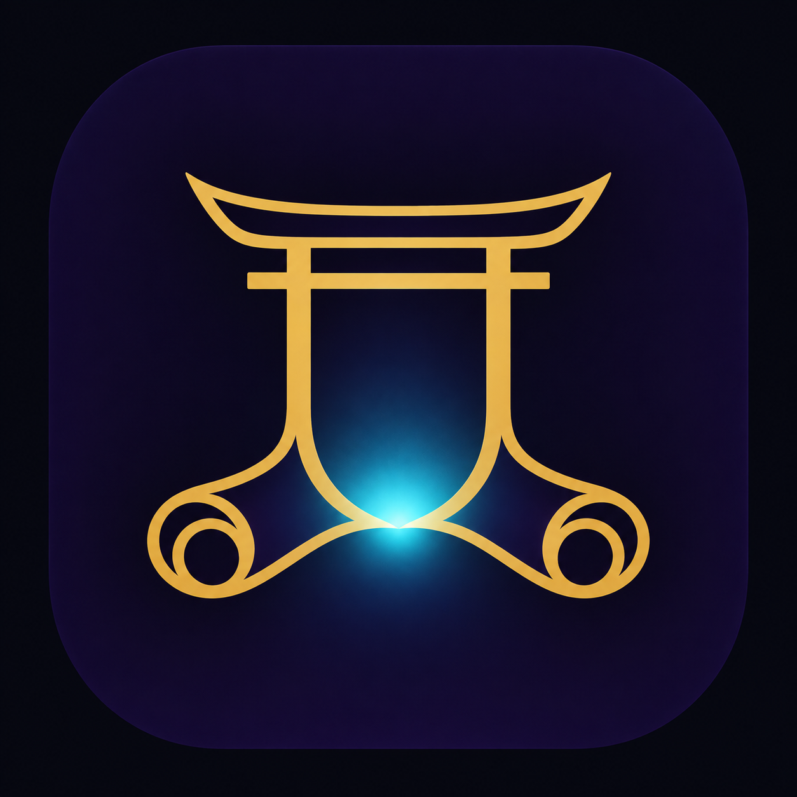



  

<h1 align="center">
  Makimono (巻物)
</h1>

  <b>Sacred Anime &amp; Media Archive Client for Android &amp; Android TV</b> 
  High-performance direct cloud streaming from Google Drive with native fansub subtitle styling and seamless in-app updates.

  Powered by <a href="https://developers.google.com/drive/api">Google Drive API</a>, <a href="https://github.com/google/ExoPlayer">ExoPlayer</a> + FFmpeg Extension, and <a href="https://github.com/mpv-android">mpv-android</a>.

  
  

 

## ✨ Highlights

- **Native Fansub Subtitle Rendering**: Fully preserves custom SSA/ASS font styles, colors, and dialogue formatting while automatically normalizing vertical placement right above the bezel across TV and mobile displays.
- **Dual Playback Engines**: Built-in ExoPlayer (with custom FFmpeg software audio decoders for DTS/AC3/EAC3) and native MPV playback engine.
- **Automatic In-App Updater**: Automatically detects newer releases from GitHub, selects the optimal architecture APK (`armeabi-v7a` for TVs, `arm64-v8a` for phones), downloads with a progress interface, and triggers seamless system package installation.
- **Themes**: Tokyo Night, Catppuccin Mocha, Dracula, Nord, and Kodi Estuary.
- **Android TV & Leanback Support**: Native D-pad navigation, Leanback launcher banner, and TV-optimized controls.

---

## 📥 Download

Get the latest APK directly from [GitHub Releases](https://github.com/takaokensei/makimono/releases/latest).

---

## 🔑 Drive OAuth Setup

Makimono connects directly to your private Google Drive using standard OAuth 2.0. To set up your credentials, create a Google Cloud Project with the Google Drive API enabled, and configure your client ID and client secret.

---

## 📜 License

This project is licensed under the Apache License 2.0. See [LICENSE](LICENSE) for details.
